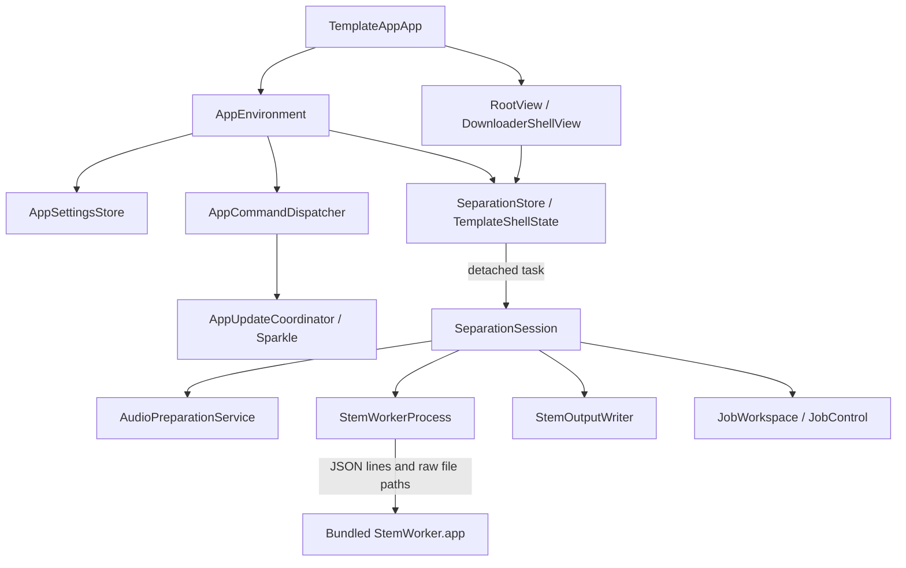

# Stem Separator — architecture and future-agent guide

**Current release: 0.1.2 / build 102**, verified September 15, 2026. App source is `1f0bdbdc451dcc955fd4c9b8a5f47b24b10a713a`; later verification/test/documentation commits do not alter shipped bytes. Read [MPS implementation](STEM_SEPARATOR/PERFORMANCE/003_MPS_IMPLEMENTATION.md), [karaoke and release slices](STEM_SEPARATOR/KARAOKE/002_RELEASE_SLICES.md), and [completed acceptance](STEM_SEPARATOR/RELEASE/evidence/release-0.1.2-acceptance.md). Historical release details below are labeled where retained.

## 1. Start here and preserve these decisions

Read this guide, [current release checklist](STEM_SEPARATOR/RELEASE/RELEASE_CHECKLIST.md), [actual acceptance evidence](STEM_SEPARATOR/RELEASE/evidence/release-0.1.2-acceptance.md), and [release maintenance](STEM_SEPARATOR/RELEASE/RELEASING.md) before changing the app. [Master release plan](STEM_SEPARATOR/RELEASE/369_MASTER_RELEASE_PLAN.md) and numbered slices preserve rationale; their proposed file lists are superseded where the implementation consolidated work. The former architecture README is retained locally as `STEM_SEPARATOR/REFERENCE_TEMPLATE_ARCHITECTURE.md`; it is not a public build input.

Settled product boundaries:

- Native macOS SwiftUI/AppKit app, Apple Silicon, macOS 15.1+, free. No HTML/CSS/Electron wrapper.
- One selected audio file and one active job. No persistent input library or multi-job queue.
- Bundled CPython/PyInstaller worker, Demucs 4.0.1 and one HTDemucs four-stem checkpoint; MPS inference with explicit CPU spectral transforms. No first-run model download and no user-installed Python, Homebrew, ffmpeg or command-line tools.
- Native input decoding and WAV output in Swift. Stem mode exports vocals, drums, bass, other; karaoke mode exports one summed non-vocal WAV. “🎁 Surprise” changes the fourth UI label, not its protocol identifier or `other.wav` filename.
- Keep the exact shared themes, typography, primary-button halo/bloom/press motion, footer/social/banner placement and legal modal behavior. Reuse the existing primitives directly.
- Keep minimal native menus: no Window/View, no Edit > Select All noise; updates live under Help.
- Single public GitHub source/releases repository; Developer ID, notarization and Sparkle signing on the owner's Mac. No signing secrets in GitHub Actions.
- Complete local bundled Release and signed installation/UI proof **before** pushing a candidate for clean GitHub builds. Both clean build jobs must pass for that exact source before Apple submission.

The preserved older external handoff is `../STEM_SEPARATOR-RELEASE`: the unchanged `.app`, DMG, Sparkle ZIP, signed appcast, corresponding-source archive, checksums and handoff README. Its “V1” label means the first completed product generation; the real version remains 0.1.1. Current 0.1.2 artifacts are in `release-evidence/0.1.2-102/`. Never silently relabel or rebuild already published bytes.

## 2. Repository map and build authority

Paths below are relative to the project root.

| Path | Responsibility |
| --- | --- |
| `project.yml` | XcodeGen source of truth: versions, arm64, deployment floor, Sparkle revision/feed/public key, source/resource lists and targets. Regenerate the Xcode project after changes. |
| `TemplateApp.xcodeproj` | Generated project; do not independently maintain divergent settings here. |
| `TemplateApp/Info.plist` | Bundle substitutions and Sparkle policy flags. |
| `TemplateApp/App` | Composition, settings, lifecycle, menu commands, updater integration. |
| `TemplateApp/Shared/AppTheme.swift` | Theme palette, fonts, window/layout metrics and shared motion values. |
| `TemplateApp/UI` | Product shell, legal/theme surfaces and workflow views. |
| `TemplateApp/Separation/Domain` | Sendable data/event/error types. |
| `TemplateApp/Separation/Application` | Main-actor observable state and synchronous background session orchestration. |
| `TemplateApp/Separation/Infrastructure` | AVFoundation input, subprocess bridge/control, private workspaces and transactional PCM output. |
| `runtime/worker/stem_worker.py`, `runtime/StemWorker.spec` | Worker protocol/inference and PyInstaller bundle definition. |
| `runtime/*lock*`, `runtime/provenance.json` | Pinned runtime inputs and model/interpreter provenance. |
| `Packaging` | Release configuration, pinned tools/corresponding sources and DMG layout/assets. |
| `scripts` | Build, audit, signing, artifact handoff, notarization, publication and validation tooling. |
| `Tests/SeparationTests.swift`, `UITests/StemSeparatorUITests.swift`, `Tests/Release` | Native unit/integration, installed UI/update, and Python release-tool tests. |
| `docs/LEGAL` | Bundled policies, full third-party notices and source/relinking information. |
| `release-evidence/<version>-<build>` | Ignored, durable local candidate/Apple/CI/publication records and final artifacts. |
| `build` | Reconstructible tooling, caches, derived data and diagnostic outputs. Do not treat arbitrary apps here as final releases. |

Product/scheme/module still use internal `TemplateApp` names. `TemplateShellState` is a **typealias for SeparationStore**. `DownloaderShellView` is the branded layout, not a download engine. Avoid a broad rename just to remove inherited internal names.

`TemplateApp` is the shipping target. `StemSeparatorTests` is an app-hosted unit target with an explicit source path to `Tests/SeparationTests.swift`; do not include the whole Tests directory, Python release tests, or `__pycache__` as Xcode resources. That previously caused clean-generation drift. `StemSeparatorUITests` is a separate UI runner. `TemplateButtonOverlayRenderer` is a developer rendering tool, not part of the shipping scheme's app payload.

The XcodeGen exclusion list explicitly removes `AppDownloadIntake.swift`, `ProductionDebugLogger.swift`, `Download/**`, `Runtime/**`, `RuntimeDependencies/**` and four old downloader UI components. Some historical/ignored files may remain locally. Their presence is not permission to revive or compile the old Tone Downloader runtime. Public Git allowlists and the build inclusion list are separate boundaries.

## 3. Composition and thread ownership



`TemplateAppApp.swift` creates a single SwiftUI Window and a `@StateObject AppEnvironment`, installs `AppDelegate`, and chooses ResponsibleUseGateView or RootView according to settings. The delegate handles initial window framing, app termination and resilient native menu cleanup.

`AppEnvironment` constructs settings, one store and the command dispatcher, derives `isAuthorized` from responsible-use acceptance, gives `AppLifecycleCoordinator` a weak store reference, and invokes store cleanup recovery on launch and disk-mount notifications using a utility detached task. Combine forwards settings changes and updates authorization on the main actor.

`SeparationStore`, `AppCommandDispatcher`, `AppSettingsStore`, `AppUpdateCoordinator` and lifecycle/UI state belong to `@MainActor`. Metadata inspection and a complete synchronous `SeparationSession.run` execute in detached user-initiated tasks. Worker pipe reads, AVFoundation conversion and WAV writes must never move onto the UI actor.

`JobControl` is `@unchecked Sendable` because its mutable cancellation/process state is guarded by NSLock. `ConverterInputReader` has the same annotation for a different reason: AVAudioConverter invokes its block synchronously, and its file/buffer/error never escape the single background conversion. Preserve these ownership assumptions; the annotation does not make arbitrary concurrent access safe.

## 4. Store state and user interaction

`SeparationStore.swift` owns optional selection/destination/result/stage/progress/message, inspection and destination-picker flags, authorization/updater flags, a selection-generation UUID, a job UUID and JobControl.

Exact availability rules:

```text
isBusy   = jobID != nil
canStart = isAuthorized && !isBusy && !isInspecting && !updaterBusy
           && !isChoosingDestination && selection != nil
canSelect = isAuthorized && !isBusy && !updaterBusy && !isChoosingDestination
```

`canSelect` deliberately allows replacing/clearing during metadata inspection. Every `accept` assigns a generation token; completion from an older inspection is ignored. `clearAudio` changes that token before clearing selection, inspection, result and message. It deletes no input file. A failed replacement currently displays invalid-audio copy while retaining any previous valid selection; do not document it as always clearing the old audio.

Audio picker: synchronous NSOpenPanel, one file, no directories, allowed UTTypes derived from supported extensions. Drag/drop: `AudioInputPanelView.dropDestination(for: URL.self)` calls the same `accept` method. Multiple URLs produce “Drop one audio file at a time.” The view rejects drops when selection changes are disabled. The selected URL lives in memory; reading metadata is not a permanent import/copy.

The X appears for an existing selection or pending inspection. Its button invokes `clearAudio`, uses `ToneControlMotionButtonStyle`, and has explicit balanced NSCursor pointing-hand push/pop on hover, disabled transition and disappearance. Preserve cursor cleanup or the cursor can remain stuck.

Clicking Separate Stems first sets `isChoosingDestination` and opens an asynchronous directory-only NSOpenPanel, with create-directory enabled and the previous valid destination as its initial directory. The panel prompt itself is “Separate Stems.” Cancelling never starts a job or falls back to an old folder. Choosing a folder records a security-scoped bookmark and then calls `startJob`. Guarding both entry points prevents double starts.

`startJob` captures the selection and destination, creates a UUID/control, clears old result/error, and starts the detached session. Progress updates hop to MainActor and must still match the active job UUID; updates are ignored while cancelling. On completion the store clears busy/control/stage/progress. Only a successful committed directory becomes `result`. Cancellation/failure leaves the selected original available for retry.

`StemOutputPanelView` shows Cancel during a job, indeterminate UI for stages without numeric progress, real percentages during inference, or error/success with Show in Finder. The primary button temporarily retains its visual enabled pulse for `AppMotion.shellBloomDuration`; `.allowsHitTesting(canPerformPrimaryAction)` still blocks a second action. This is motion preservation, not permission to start another job.

## 5. Native audio preparation

`AudioPreparationService.inspect` accepts file URLs with `wav`, `wave`, `aif`, `aiff`, `mp3`, `m4a` extensions. AVAudioFile must decode the file. Frames must be nonzero, duration finite and ≤1200 seconds, channels 1–2. Protected or unreadable M4A is rejected through the decoder. Security-scoped access is started/stopped around each read.

`prepare` re-inspects to catch changes since selection, then converts through AVAudioConverter to float32, 44,100 Hz, two-channel PCM. Input/output AVAudioPCMBuffers hold at most 8192 frames. Although the converter output buffers are non-interleaved, Swift explicitly writes interleaved left/right Float samples to private `input.f32le`. On the arm64 target these bytes are little-endian. Nonfinite samples, conversion errors, zero frames and a converted length over 44,100 × 1200 frames fail. It checks cancellation between conversion iterations. It does not modify or delete the source file.

The worker receives decoded raw PCM in a fixed format, never an arbitrary audio codec file. Amplitude normalization happens inside the worker. Do not add ffmpeg/SoX or Python audio decoding without revisiting packaging and notices.

## 6. Session, free space and workspace lifecycle

`SeparationSession.run` obtains a JobWorkspace lease and scoped destination access. It verifies the destination is a directory, checks available important-usage capacity when supplied by the filesystem, and tries creating/removing an owned probe directory. The estimate is `durationSeconds * 44100 * 64 + 512 MiB`. This estimate is independently checked on destination and temporary volumes; availability can still change during processing, so runtime I/O errors still need safe handling.

Order: workspace → destination checks → `.preparing` → native conversion → worker → `.writing` → StemOutputWriter commit → return final folder (stems) or file (karaoke). The lease stays alive throughout and removes private working files on deinitialization.

`JobWorkspace.root` is `FileManager.default.temporaryDirectory/StemSeparatorJobs`, not a hard-coded /tmp or Application Support directory. Each job uses a UUID directory with mode 0700, `.owner = StemSeparatorJob-v1`, and a mode-0600 `.lock` opened with O_NOFOLLOW and held using exclusive nonblocking flock. A second app instance must not sweep a live job.

Recovery uses durable metadata-only journals in Application Support/CleanupRecovery as well as legacy temporary records. Journal and workspace locks protect live jobs; UUID, non-symlink and ownership checks protect unrelated data. It resolves the destination bookmark without UI, validates the staging name/owner, removes payload before ownership markers, and retains the durable record on any failure or unavailable destination. Local temporary audio is removed independently. Temporary-directory purging no longer loses output cleanup records. Pending cleanup is visible in the store/UI and retried on launch, disk mount and the next job. Never broaden deletion to guessed folders or final user outputs.

## 7. Subprocess boundary and JSON protocol

`StemWorkerProcess.bundledExecutable` resolves exactly:

```text
Stem Separator.app/Contents/Helpers/StemWorker.app/Contents/MacOS/StemWorker
```

It uses Foundation Process with an executable URL, not a shell command. Working directory is the private job directory. The environment is explicitly limited to PATH `/usr/bin:/bin`, job HOME/TMPDIR, PYTHONNOUSERSITE=1, OMP_NUM_THREADS=4 and PYTORCH_ENABLE_MPS_FALLBACK=0. Stdout carries protocol; stderr drains concurrently and is discarded by the Swift bridge. There is a 45-second ready-handshake watchdog and a 10,800-second total worker watchdog. Stdout records must be newline terminated and smaller than 65,536 bytes. Protocol/JSON failure stops the worker, waits for exit/drain, then returns a sanitized failure.

Handshake is `{"protocolVersion":1,"type":"ready","device":"mps",...}` without jobID. Swift sends one request after ready:

```json
{
  "protocolVersion": 1,
  "type": "separate",
  "jobID": "lowercase-uuid",
  "input": {
    "path": "/private-job/input.f32le",
    "frames": 617400,
    "channels": 2,
    "sampleRate": 44100,
    "layout": "interleaved",
    "sampleType": "float32-le",
    "byteCount": 4939200
  },
  "outputDirectory": "/private-job/worker-output",
  "modelID": "htdemucs",
  "device": "mps",
  "outputMode": "stems"
}
```

Paths here are protocol examples, not hard-coded application locations. Every subsequent event has matching lowercase jobID and an exact increasing sequence starting at 1. Events:

| Type | Validation/use |
| --- | --- |
| `stage` | Recognized SeparationStage raw value; indeterminate UI. Normal worker stages are loadingModel and writing. |
| `progress` | Integer `totalUnits` >0 and `completedUnits` between 0 and total; fraction = completedUnits/totalUnits. Worker emits `stage: separating`; Swift routes every valid progress event to `.separating`. |
| `result` | Exact input frame count, stereo/44100/float32-le/interleaved, matching `outputMode`, device `mps`, and exactly the expected names (four stems or only `karaoke`); each `stems` entry has `name`, `file: name.f32le`, and `byteCount: frames*8`. |
| `error` | modelIntegrity gets a specific reinstall error; mpsUnavailable explains GPU/macOS requirements; other codes get generic engine-failure copy. |

Swift rejects further events after result, wrong job/sequence, unknown event type, incomplete final line and nonzero/abnormal process exit. Success needs both a valid result and exit 0. Raw file sizes and sample finiteness are checked again by the output writer; trusting the JSON alone is insufficient.

Production UI cancellation uses JobControl: mark cancelled under lock, terminate the attached Process, then SIGKILL after two seconds if still running. It does **not** send the JSON cancel command. The worker also supports `{"type":"cancel","jobID":"..."}` for control-protocol tests and exits 130 immediately on that command or parent stdin EOF. Its daemon control thread can exit while native inference is executing. App cancellation is ultimately surfaced through `control.check()`, with original audio preserved.

`SeparationStage.committing` exists in the domain but the current session does not emit it separately. Numerical progress counts completed model chunks; loading, preparation and writing are indeterminate. A model percentage of 100 is not permission to show final success before WAV commit.

## 8. Worker/model implementation

`runtime/worker/stem_worker.py` emits ready before importing heavy ML packages. It validates protocol version, request type, UUID, integer frames in (0, 44,100×1200], exact format/byte count, model/device, a regular non-symlink input of the stated size, and an output directory that does not already exist. The parent-death/control watcher starts before model loading.

Checkpoint `955717e8-8726e21a.th` has SHA-256:

```text
8726e21a993978c7ba086d3872e7608d7d5bfca646ca4aca459ffda844faa8b4
```

The worker locates it relative to PyInstaller's `_MEIPASS`, verifies the full hash **before** torch.load(weights_only=False), and verifies model sources are vocals/drums/bass/other. Do not accept arbitrary external pickle checkpoints or change this hash independently of provenance, build download verification and model assessment.

Runtime: CPython 3.11.16 (Astral python-build-standalone 20260901), Demucs 4.0.1, torch/torchaudio 2.6.0, NumPy 1.26.4, PyInstaller 6.16.0. Exact package artifacts/hashes live in the lock files; this prose is not a substitute for them.

Inference sets up to four torch threads, one interop thread and seed 0. Input becomes a `[2,frames]` tensor. It validates finite samples, computes a mono reference mean/std using unbiased=False, normalizes with epsilon 1e-8, and applies the model under inference_mode with MPS (no implicit CPU fallback), shifts=0, segment=7.8 seconds, split=True, overlap=0.25, num_workers=0. A custom ProgressPool executes deferred chunks and synchronizes MPS before emitting each completed chunk. Total is `ceil(frames / int(0.75 * int(44100 * 7.8)))`; 14 seconds gives 3 chunks, 180 gives 31. Result is denormalized, required to be finite and shape `[4,2,frames]`, and either written as four interleaved little-endian float32 files or summed by explicit drums/bass/other source names into the sole karaoke float32 file. Vocals are never serialized in karaoke mode.

Worker exit codes: 0 success; 10 invalid request/input; 20 model identity/integrity/source mismatch; 21 unavailable MPS/macOS; 30 invalid output/unhandled worker failure; 130 explicit cancel/parent EOF. Unhandled exceptions emit a generic workerFailure event and only the exception class on stderr. App SIGTERM/SIGKILL cancellation is separate from these voluntary exit codes.

## 9. Transactional output and naming

`StemOutputWriter.commit` creates `.stem-separator-<UUID>` **inside the selected destination**, mode 0700, and records its owner/bookmark in the workspace before output work. It scans every raw stem in 65,536-byte blocks, checks cancellation, requires regular files of `frames*8` bytes, and rejects nonfinite samples.

A common peak across all stems starts at 1. Gain is 1 when peak ≤1, otherwise `0.999/peak`; this avoids PCM clipping while retaining relative stem balance. Each output has a 44-byte RIFF/WAVE PCM header, 2 channels, 44,100 Hz, 24 bits/sample, 6 bytes/frame. Samples are clipped to [-1,1], multiplied by 8,388,607, rounded and emitted as three little-endian bytes. Files are synchronized and closed before commit. There is no per-stem loudness normalization or dithering step.

The source basename loses its extension; `:` and `/` become `-`, and the name is limited to 100 Swift Characters. Empty names fall back to Audio. It tries `<name> - Stems`, then ` (2)` … ` (10000)`. `renamex_np(..., RENAME_EXCL)` atomically and exclusively renames the staging directory on the same volume. Existing results are never overwritten, including races. The owner marker is removed after successful rename; deferred staging removal does not target the final renamed directory. Only then can the store publish success.

`reveal()` checks that result still exists and invokes `NSWorkspace.shared.activateFileViewerSelecting`. A moved/deleted result becomes an explanatory UI message. Completed results and input files are not temporary workspace cleanup targets.

## 10. Brand, legal and menus

`RootView` owns theme selection and legal-modal state. `DownloaderShellView` arranges BrandColumn, the retained banner, ThemeCorner, two 352-point-high workflow panels and the footer. `TemplateFeaturePanelView` supplies the shared panel surface. The app icon lives in `TemplateApp/Assets.xcassets/AppIcon.appiconset`; inspect asset references in BrandLogoMarkView/BrandColumnView before changing the in-app logo.

Authoritative visual files: AppTheme.swift (all palette/typography/window/motion numbers), PrimaryDownloadButton.swift (TemplatePrimaryActionButton), ToneControlMotion.swift, SecondaryActionButton.swift, ThemeCornerView.swift, ThemeBloomOverlayView.swift, ExitPresenceContainer.swift, AppShellBackgroundView.swift, BrandColumnView.swift, BrandLogoMarkView.swift, AppFooterSurfaceView.swift and AppFooterSocialLinksView.swift. Do not replace these with “similar” animations or newly estimated numbers. Prior release proof checked protected primitive hashes against the baseline.

ResponsibleUseGateView is a versioned first-use acknowledgment, not payment or licence activation. AppLegalDocumentCatalog and AppLegalDocumentModalView load bundled docs/LEGAL resources. Preserve the existing overlay/modal behavior; Help > Third-Party Notices opens the bundled Markdown through NSWorkspace. Terms, Privacy and social links remain in the footer; external banner/social destinations were explicitly retained by the owner.

`AppDelegate.cleanMenus` runs at launch, activation, application update, menu add/change notifications and delayed cleanup passes (0, .05, .15 seconds). It clears windowsMenu, removes Window/View and Edit > Select All, and rebuilds the application menu only if it differs from About/separator/Quit. Rebuilding an already correct menu on every event previously interfered with picker keystrokes.

Commands route through AppCommandDispatcher: Open Audio (Cmd-O), Separate Stems (Cmd-Return), Cancel Separation (Cmd-.), Help > Check for Updates..., Third-Party Notices. View/window/toolbar/sidebar/textEditing command groups are replaced with empty groups. Native file panels must retain working keyboard interaction.

Quit during a job offers Keep Separating or Cancel and Quit. On confirmation, AppLifecycleCoordinator cancels, returns terminateLater and polls isBusy every 100ms before replying to NSApp. It does not immediately abandon a live worker. No job automatically resumes at startup.

## 11. Persistence, privacy and update mutual exclusion

Preference domain is the permanent bundle ID `com.oliviergrenierbedard.stemseparator`.

| Key | Owner / behavior |
| --- | --- |
| `stem-separator.v1.theme` | RootView @AppStorage; defaults to jazz-atelier, resolved through AppThemeCatalog. |
| `stem-separator.v1.responsible-use-version` | AppSettingsStore integer; current required version 1. Old template acceptance is not reused. |
| `stem-separator.v1.output-bookmark` | SeparationStore Data; resolve security scope without UI on startup; discard invalid/stale value. Only picker starting location, never implicit permission to start a job. |

Selection, result, current job, progress and errors are in memory. Durable staging.json includes a destination bookmark and must stay private; it contains no audio. Sparkle maintains its own preferences/cache. Never export real bookmark content or user filenames into public issue/CI logs. Migration must preserve the domain and stable keys unless a deliberate tested migration is added.

SeparationSession logs OSLog subsystem `com.oliviergrenierbedard.stemseparator`, category `separation`: start, elapsed completion seconds, and failure phase plus a whitelisted Cocoa/POSIX/OSStatus domain and numeric code. It never logs localizedDescription/userInfo. Swift discards worker stderr. The protocol necessarily carries private temp paths locally; that does not authorize public logging of requests. There is no audio upload, account, payment or analytics. Update checks and clicked external links use the network. Network denial is explicit in the offline test harness, not an OS network sandbox entitlement on the shipping app.

AppUpdateCoordinator wraps SPUStandardUpdaterController. It validates the HTTPS GitHub latest/download/appcast.xml URL and a 32-byte base64 Ed25519 key, rejecting placeholders, credentials, port, query and fragment. It observes canCheckForUpdates/sessionInProgress and publishes sessionBusy. AppCommandDispatcher transfers that to store.updaterBusy, blocking new input/jobs during an update session. Its isSeparationBusy closure checks active jobs and an open destination picker; it does not separately block metadata inspection. Both menu checks and Sparkle delegate mayPerform guard this boundary.

Info.plist enables automatic checks, requires a signed feed and verifies the update before extraction. Do not disable these for troubleshooting. Stable feed:

```text
https://github.com/olivierbedardjazz-star/stem-separator/releases/latest/download/appcast.xml
```

Public key is in project.yml. Private key remains in local Keychain account `stem-separator-ed25519`. Apple team is `5SVUWU2ZGY`, notary profile `notary-profile`; Packaging/release-config.json is the canonical release configuration. Do not export credentials to docs/Git or rotate the key during ordinary releases.

## 12. Runtime build, bundle layout and licences

Build flow: bootstrap pinned XcodeGen → obtain/hash-check standalone CPython → create build/StemRuntime/portable-venv → install exact locked artifacts → hash-check model → collect notices → PyInstaller → native dependency audit. `scripts/install_locked_runtime.py` uses artifact hashes, installs pinned wheels and builds source packages without fetching undeclared build dependencies, and runs pip check. A reused local cache is not equivalent to a cold clean build; CI reconstructs independently without caches.

StemWorker.spec explicitly includes the checkpoint, Demucs data and model implementation imports. Unused scientific/UI/test packages are excluded. Optional torchaudio SoX native extensions are removed because decoding is native Swift and those extensions referenced unbundled libsox. Do not restore them or add a decoder without bundling/licensing/signing/proving it.

```text
Stem Separator.app/Contents/
  MacOS/Stem Separator
  Frameworks/Sparkle.framework/…       # nested updater/XPC components
  Helpers/StemWorker.app/Contents/
    MacOS/StemWorker                   # frozen arm64 executable
    …                                 # PyInstaller framework/resources/symlinks
  Resources/
    StemRuntimeMetadata/
      provenance.json
      dependency-inventory.json
      requirements-lock.txt
      artifacts-lock.json
      python-build-metadata.json
      manifest.json
    RuntimeLicenses/…                 # folder resource with full texts
    …                                 # legal Markdown, assets, other native resources
```

Inspect the actual helper rather than assuming a plain virtualenv layout: PyInstaller arranges framework/resources through internal symlinks. `embed_stem_runtime.sh` rsyncs the complete worker bundle into the app and writes metadata/manifest. `create_runtime_manifest.py` inventories each regular file's size/hash and each symlink target. This manifest is packaging evidence; the running worker explicitly verifies the model hash, and the native bridge does not dynamically validate every manifest entry at job start. Code-signing validation is a separate layer.

Any new model, interpreter, helper, framework or audio library is a first-class runtime: pin source/hash, examine dependency and minimum-OS closure, include notices/provenance/corresponding sources as required, sign nested code, prove offline execution in the app, repeat clean CI and Apple gates. `runtime/provenance.json` still contains historical releaseStatus “release-preparation”; current release state comes from artifact-bound evidence, not that descriptive string. Do not edit a released app's resource to cosmetically update it.

The model's historical MIT distribution assessment was explicitly supplied by the owner and recorded in [model-owner-assessment](STEM_SEPARATOR/RELEASE/evidence/model-owner-assessment.md). It is not an agent's independent legal opinion and must not be silently replaced with a different checkpoint. Full package notices live in docs/LEGAL, including Python/PyTorch/NumPy/Demucs/Sparkle and retained dependency texts. The corresponding-source lock/archive and RUNTIME_SOURCE_AND_RELINKING.md address relevant GCC/runtime and other source requirements. Free pricing/public source do not relicense all app code/artwork as MIT; root LICENSE describes ownership and third-party exceptions.

## 13. Release architecture and immutable artifacts

Follow [scripts/RELEASE_PIPELINE.md](../scripts/RELEASE_PIPELINE.md) and [RELEASING](STEM_SEPARATOR/RELEASE/RELEASING.md). Canonical implementation is scripts/release_pipeline.py, not the historical template stamp/newest-file scripts. It derives explicit version/build paths from project.yml and configuration from Packaging/release-config.json, with a local execution lock. No credentials-bearing self-hosted public runner is used.

Required sequence:

1. Review source/dependencies/notices; test Debug/Release; commit locally.
2. Archive a candidate into release-evidence/version-build; bind source SHA/config/model/toolchain.
3. Sign native helper leaves and nested containers, sign nested Sparkle, regenerate the embedded helper manifest **after signing**, then seal the outer app last. Run strict signature/notices/legal and real worker/control checks.
4. Create signed provisional DMG, mount/copy into isolated installed directory, run actual signed native UI and offline proof locally. Only then push candidate source.
5. Clean macOS build workflow reconstructs runtime, checks generated-project drift, builds Release, runs native Debug and release-tool tests plus offline/control checks on macOS 14/Xcode16.2 and macOS26/Xcode26.3. Store exact-source successful run ID. Apple commands recheck live GitHub success against archived source.
6. Submit exact app ZIP once, store submission ID/hash, query on subsequent calls. Only Apple Accepted enables app stapling. Do not rebuild/re-sign after submission.
7. Build/sign final DMG from stapled app, submit/await Accepted, staple/validate DMG.
8. Create Sparkle ZIP from stapled app. Pinned generate_appcast signs ZIP and feed; verify_sparkle_signatures.swift uses only the embedded public key to verify both, plus URL/length/build/version/minimum OS. Do not add the earlier redundant sign_update Keychain call.
9. Include corresponding sources/checksums. Publish complete draft assets, promote latest, anonymously download/hash-check every asset and verify the stable latest feed. Never overwrite a published tag's bytes.
10. Verify public installed DMG on clean hosts (checksum, mount/copy, quarantine, Gatekeeper, tickets, offline runtime) and a real installed predecessor→successor Sparkle transition. Check preserved settings/files and post-update separation.
11. Retain final artifacts/evidence outside build, update sanitized acceptance/checklist, and keep private keys in Keychain.

`release_record.py` computes file SHA-256 or a deterministic directory fingerprint of sorted relative file paths, permission modes/content hashes, and internal symlink targets. Escaping/broken links are rejected. Records bind an absolute artifact path and hash and are written atomically. Signing and stapling intentionally transform bytes, so old stages remain history while final-stage records validate the current final artifacts. `release_status.py --complete` reports missing/changed recorded gates; it does not create success or perform a release.

Pipeline phases: archive, sign, provisional-dmg, install-proof, notarize-app, staple-app, final-dmg, notarize-dmg, staple-dmg, sparkle, publish. `export_release_app.sh` and `finalize_exported_app_for_notarization.sh` both dispatch sign: do not run them as two independent sequential signing phases. The CLI refuses conflicting existing candidates/releases. Notarization supports submit-once/status-query; publication is not a general automatic recovery engine for partial drafts. Inspect a failed draft and verified bytes before resuming.

Published assets: DMG for first installation; ZIP+signed appcast for Sparkle; Corresponding-Sources.tar.gz and SHA256SUMS.txt. The separate `.app` in the local handoff is a copy of the stapled app, not an extra GitHub installer. Final 0.1.2 source tag remains 1f0bdbd… even when later verification/documentation changes main. Future product changes require a new version/build and renewed gates, never replacement assets behind any existing release URLs.

## 14. Build/test commands and diagnosis

From the source root, on an Apple Silicon Mac with Xcode:

```sh
scripts/build_local_release_app.sh
# Creates an unsigned Release-optimized local app, not distributable evidence.
open 'build/LocalRelease/DerivedData/Build/Products/Release/Stem Separator.app'
```

For an existing constructed runtime, regenerate/build as needed:

```sh
build/BuildTools/xcodegen/bin/xcodegen generate
build/StemRuntime/portable-venv/bin/python -m unittest discover -s Tests/Release
xcodebuild test -project TemplateApp.xcodeproj -scheme TemplateApp \
  -configuration Debug -destination 'platform=macOS,arch=arm64' \
  -derivedDataPath build/DebugTests/DerivedData -only-testing:StemSeparatorTests \
  CODE_SIGNING_ALLOWED=YES CODE_SIGN_IDENTITY=- \
  ENABLE_HARDENED_RUNTIME=NO ENABLE_TESTABILITY=YES
```

Signing/testability overrides here are for test-host injection only, not production. A repeated local Debug launch later stalled in dyld before startup; earlier Debug tests and final exact-source hosted suites passed. Samples are retained with release logs. If it recurs, identify the exact process/path and inspect loader/permission state; do not silently disable OS protections, edit TCC databases or claim it passed. Run tests sequentially when they share app identity, and never overwrite a running tested app bundle.

Installed UI tests are built with xcodebuild build-for-testing, then test-without-building using a copied xctestrun **beside the original Products-directory file** so relative paths resolve. Set UI target UITargetAppPath and EnvironmentVariables.STEM_TEST_APP to the exact signed installed app, not an arbitrary Debug app. `testNativeWorkflowMenusAndLegalSurface` covers native input/picker cancellation/separation/legal/menu behavior; `testInstalledAppReportsUpToDate` covers current-release response. The optional STEM_TEST_PREPARE_UPDATE=1 chooses a non-default theme from initial Jazz Virtuoso for migration proof. Real updater test uses STEM_UPDATE_APP and STEM_UPDATE_BUILD and `testInstalledSparkleUpdate`. Read the maintained guide for the full sequence. Never treat manually copying B over A as an updater pass.

`runtime/test_worker.py` exercises 14-second/3-chunk frozen inference under network denial, empty HOME and minimal PATH. `test_worker_control.py` covers cancel/parent EOF/invalid request. Additional release-specific benchmark/cancellation harnesses and logs are retained under local release-evidence. Native tests exercise codec conversion, transactional WAV formats/naming, real worker, cancellation/failure/recovery, settings and UI-state guards. Tests use synthetic audio; do not upload owner music or unsanitized log paths.

Production troubleshooting order: confirm exact app path/build → verify signatures/ticket/helper presence → inspect sanitized separation phase/domain/code → reproduce with a generated fixture and available local destination → check helper protocol/exit and model hash → inspect output transaction. Preparing failure is native decoding; engine failure is process/protocol/model; saving failure is validation/writing/rename. Do not blame bundling merely because a job failed or mistake model 100% for final commit success.

## 15. Known proof limits and safe future changes

Completed 0.1.2 evidence includes signed local UI before remote builds, exact-source macOS15/26 clean builds with actual MPS inference, notarized/stapled app and DMG, public downloaded/quarantined binary checks, real 0.1.1→0.1.2 update, preserved settings/files and post-update stems/karaoke. Synthetic 10/20-minute tests and signed 20-minute karaoke passed; 20-minute peak sampled process memory was approximately 7.8 GiB on a 64 GiB Mac. See the version-specific acceptance report for exact times and limitations.

Remaining coverage: real vocal-music listening, lower-memory physical Macs, broader iCloud cases, human Finder-drag/fresh-account workflows, independent secure backup/key continuity. Automated installation/Gatekeeper/UI proof is not a claim that those additional scenarios were performed.

Change routing:

| Desired change | Start in | Also revisit |
| --- | --- | --- |
| Input extension/codec/duration | AudioPreparationService, AudioInputPanelView | worker max frames, space estimates, conversion/native tests, README/policies |
| Output naming/format | StemOutputWriter | frame/byte contracts, raw result validation, folder collision/cancel tests; do not confuse Surprise label with identifier |
| Progress/cancel/state | SeparationStore, StemWorkerProcess, JobControl, worker ProgressPool | races, watchdogs, late-event UUID guards, lifecycle/update exclusion |
| Model/inference/runtime dependency | worker, provenance, locks, spec, build scripts | complete licensing/source closure, model hash in all consumers, native audit/signing/offline/CI/notary proofs |
| Theme/motion/layout | existing shared visual files and focused workflow views | exact primitive identity, hover cursor balance, pulse hit-testing, screenshots/legal/footer/menu regression |
| Preferences or responsible-use version | RootView, AppSettingsStore, SeparationStore | migration/stale bookmark tests, real updater transition; never reset another product's domain |
| Release/version/update feed | project.yml, release config and pipeline | permanent ID/key continuity, XcodeGen, immutable source/artifact records, two-version proof |

Before any future edit, inspect git status and distinguish tracked source, local untracked historical docs, ignored old downloader files, build caches and immutable release evidence. Do not delete or commit all of them indiscriminately. Documentation-only corrections do not require mutating a signed app. Product/runtime changes do require a new reviewed build and full affected release gates.

Post-release investigation: see [performance/storage test plan](STEM_SEPARATOR/PERFORMANCE/001_PLAN.md) and [measured findings](STEM_SEPARATOR/PERFORMANCE/002_RESULTS.md). These test-only changes leave shipping source/artifacts intact; confirmed cleanup defects and incomplete maximum-length coverage are documented there.

## Karaoke development delta (2026-09-15)

See [karaoke plan and verification](STEM_SEPARATOR/KARAOKE/001_PLAN.md). `SeparationMode` passes from the store through the session, worker JSON `outputMode`, bridge validation and output writer. `.stems` remains the default for existing callers. `.karaoke` expects only `karaoke.f32le`, summed in memory from drums+bass+other. It commits one exclusively named `<base> - Karaoke.wav` directly in the selected destination; Finder selects that file. The store remembers mode only for the active/result UI, not in preferences. Existing bookmark identity and legal/theme settings remain unchanged.

Both buttons reuse `TemplatePrimaryActionButton` and the shared canStart/picker/job/updater exclusion. Cleanup now retains recovery metadata when an output destination is unavailable, removes local working audio independently, and logs retry failures without user paths. Sessions independently check temporary-volume capacity. Durable metadata-only journals now survive OS temporary purging; disconnected/unwritable volumes still require recovery when available; release qualification and real-song listening are separate from local functional tests.

### Durable cleanup journal (0.1.2 release slice)

`JobWorkspace.journalRoot` is `Application Support/com.oliviergrenierbedard.stemseparator/CleanupRecovery`. UUID folders contain only `.owner`, `.lock` and optional `staging.json` (destination security-scoped bookmark, staging name and owner UUID). No audio is stored there. A live job holds journal and temporary workspace advisory locks. Recovery locks the journal before touching either location, migrates legacy staging records, validates ownership and symlinks, deletes audio before markers, and retains metadata on failure. It independently removes local audio even if the output disk is missing. `recover()` returns inactive pending-job count; `SeparationStore.retryCleanup()` publishes a short warning, and AppEnvironment invokes it on launch and disk mount. Volume capacity is checked separately for destination and temporary storage. OS swap/backups and externally revoked permissions cannot be erased or bypassed by the app.
