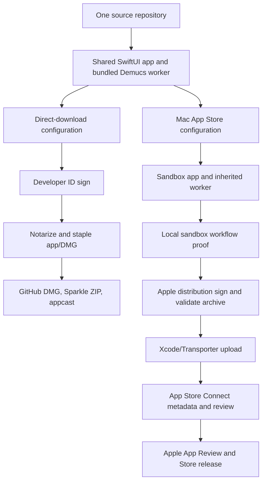

# Mac App Store distribution plan

Status: implementation in progress. This document describes a second release path from the existing repository. The Developer ID/Sparkle 0.1.2 release remains immutable and available.

## Baseline audit

- Native SwiftUI/AppKit app, bundle ID `com.oliviergrenierbedard.stemseparator`, arm64, macOS 15.1 minimum. The existing project and direct release are at 0.1.2/102.
- One PyInstaller onedir helper app under `Contents/Helpers/StemWorker.app` contains CPython, Demucs, Torch, native libraries and the verified four-source model. AVFoundation handles input decoding; the worker uses MPS and writes temporary float samples; Swift writes final WAV files.
- Current Xcode project has no App Sandbox entitlement; the release pipeline signs the main app and nested code with Developer ID and builds a notarized DMG plus Sparkle ZIP/feed. It is not an App Store archive.
- File picker, drag/drop, output picker, persisted destination bookmark, temp workspace, Application Support recovery journal, and Finder reveal are separate sandbox proof points.
- Sparkle framework, feed keys, automatic checks, and Help update command must be absent/replaced only in the Store variant. The current privacy/terms text mentions Sparkle and requires variant-aware wording.
- Current local Keychain inspection found Developer ID only. Apple distribution signing/provisioning still needs proof. No App Store Connect app record or API credential is assumed.
- No bundled FFmpeg or Electron path is involved. The original Torch-wheel `libomp.dylib` aborts in App Sandbox while registering shared memory (`OMP Error #179, Can't open SHM2`). A source-built LLVM OpenMP 23.1.2 library targeting macOS 15.1 passed a local ad-hoc-signed sandbox workflow; App Review acceptance remains unproven.

## Slice 1 — Distribution boundary and invariants

Outcome: both channels build from one codebase without cross-contamination.

Files: `project.yml`, a dedicated Store Info.plist and entitlement plists, and Store-specific updater adapter; existing direct release files remain unchanged unless a shared defect is proven.

Flow: XcodeGen emits a Store app target/scheme; shared sources compile for both; a Store compilation flag selects update behavior and legal copy. The Store bundle retains the public app identity and product name. Release checks assert the direct target still contains Sparkle and Store target does not.

Dependencies/licences: no new runtime dependency; retain current runtime licence bundle. Tests: build both variants and compare bundle contents/Info.plists. Stop if direct channel changes unexpectedly or Store variant contains Sparkle updater code/binaries.

## Slice 2 — Sandboxed helper and file access

Outcome: the sandboxed SwiftUI app can start its bundled worker and run MPS inference.

Files: Store entitlement plists, Store signing script, `TemplateApp/Separation/Application/SeparationStore.swift`, `TemplateApp/Separation/Infrastructure/{AudioPreparationService,StemWorkerProcess,JobWorkspace,StemOutputWriter}.swift` only where sandbox tests reveal defects.

Flow: main app gets App Sandbox plus user-selected read/write and app-scope bookmarks. System pickers grant input/output access; the app retains scoped access through preparation/write/recovery. The worker inherits the parent sandbox, reads the model from its signed bundle, reads/writes job data inside the app's sandboxed temp area, and never needs a system Python installation. It must not write outside its container or user-selected destination.

Dependencies/licences: the Store variant replaces only the Torch-wheel OpenMP library with LLVM OpenMP 23.1.2, built from a pinned SHA-256 source archive under Apache-2.0 WITH LLVM-exception; its licence and provenance are bundled. Sign all nested Mach-O files and their containers in correct order using Apple distribution identity for upload. Tests: signed sandboxed app, system sandbox status, picker and drag/drop access, actual MPS separation and karaoke, temp cleanup, interrupted recovery, external-volume access. Stop if helper fails inherited sandbox launch, model loading, MPS, nested signature verification, or selected-file access; diagnose before changing architecture.

## Slice 3 — Store UI, legal text, and update behavior

Outcome: same brand and workflow; Apple owns Store updates.

Files: `TemplateApp/App/{AppCommandDispatcher,TemplateAppApp}.swift`, Store updater adapter, variant legal resources, `TemplateApp/Info-AppStore.plist` (names may be adjusted during implementation).

Flow: Store build excludes Sparkle dependency, feed keys and update menu item; direct build retains exact menu/primary motion/legal/footer behavior. Store privacy/terms describe offline processing and App Store updates accurately. External social links still open the user's browser.

Dependencies/licences: same third-party notices and source obligations. Tests: menu snapshot/UI test, legal modal, bundle inspection, no Sparkle content, direct target regression. Stop on mismatched privacy claim or unintended branded UI change.

## Slice 4 — Local Store qualification

Outcome: a locally installed, development-signed sandboxed candidate proves the full user workflow.

Files: dedicated tests/scripts under `Tests/` and `scripts/`; no generated audio in repository or user output folders.

Flow: install isolated Store candidate; choose a test MP3/WAV, run four stems and karaoke, inspect output WAVs, reveal in Finder, repeat via drag/drop, exercise cancellation/relaunch/recovery. Inspect sandbox denials and app/worker entitlements. Remove only owned test files and verify job/journal roots empty.

Dependencies/licences: no change. Tests: focused native/worker tests plus GUI workflow and Gatekeeper/signature checks as appropriate. Stop if a production function fails or unowned paths are touched. The direct build must still pass its relevant regression checks.

## Slice 5 — Apple archive, signing, and validation

Outcome: Store archive/export that Apple tooling accepts, separate from notarized DMG flow.

Files: Store release config/commands under `Packaging/` and `scripts/`; no edits to published 0.1.2 assets.

Flow: record source SHA/version/build, rebuild frozen runtime if needed, archive Store scheme, sign nested leaves/helper/main app, export with Apple distribution provisioning, validate archive, retain archive/dSYMs/logs. Build numbers increase on future Store uploads. Use a verified Apple-supported binary upload path (Xcode/Transporter initially); Apple's current App Store Connect API also documents binary upload, to evaluate once credentials and an app record exist.

Dependencies/licences: preserve notices and matching corresponding-source availability. Tests: codesign strict/deep, entitlements, profile, no Developer ID/Sparkle contamination, Apple validation. Stop if no suitable distribution identity/profile or Apple validation fails.

## Slice 6 — Store record and listing

Outcome: accurate free Mac App Store page and review context.

Files: documentation/metadata under `docs/STEM_SEPARATOR/APP_STORE/` and store assets outside the app bundle; no fabricated screenshots.

Flow: establish bundle ID and app record on App Store Connect website (Apple says the REST API cannot create the initial app record), select macOS and free price, provide product text/screenshots, privacy answers, support/privacy URLs, age/export compliance, and reviewer instructions/audio fixture if needed. Automate supported metadata/asset operations after authenticated access exists.

Dependencies/licences: confirm all bundled notices/source offers remain accessible. Tests: manual cross-check text against actual Store binary and Apple field validation. Stop if the account lacks required role, agreements, rights, or required owner declarations.

## Slice 7 — Upload, processing, and review

Outcome: tested candidate uploaded and submitted, or an exact Apple/account blocker reported.

Files: local evidence records and Store automation only. Never commit `.p8` or provisioning secrets.

Flow: upload with supported Xcode/Transporter tooling; poll processing with bounded waits; attach the correct build to the version; complete required metadata; submit via supported App Store Connect API or website if API permission/coverage is insufficient. Stop waiting after 15 minutes of unchanged Apple processing and return resumable IDs/steps.

Dependencies/licences: no new package dependency. Tests: verify uploaded build ID/version/source, processing status and submission response. Stop on rejection or mismatch; do not claim public release until Apple approves and it is available.

## Slice 8 — Future two-channel release command

Outcome: documented repeatable Store release path and protected direct pipeline.

Files: Store runbook and CLI, project README release links.

Flow: `source -> Store build -> sandbox proof -> archive/validate -> upload -> processing -> version/build -> review`; direct path remains `source -> Developer ID -> notarize/staple -> GitHub/Sparkle` when a new direct release is wanted. A source change alone does not mutate an existing signed release.

Dependencies/licences: preserve provenance/notice checks. Tests: dry-run and one real Store candidate; repeat direct build/CI proof for affected shared code. Stop if a script could overwrite a prior signed release or reuse credentials outside secure local storage.
